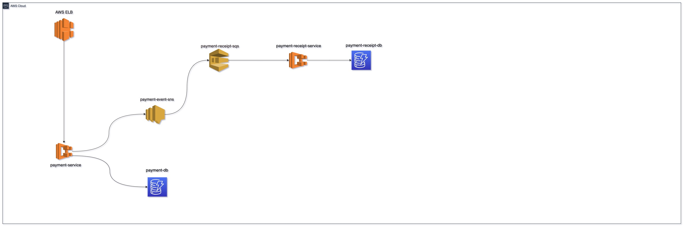

<h1 align="center">
    
</h1>

<p align="center">
  <a href="#question-about">About</a>&nbsp;&nbsp;&nbsp;|&nbsp;&nbsp;&nbsp;
  <a href="#gear-technologies">Technologies</a>&nbsp;&nbsp;&nbsp;|&nbsp;&nbsp;&nbsp;
  <a href="#rocket-getting-started">Getting Started</a>
</p>

# Project Overview:


---

## :question: About

Payment is a platform for do payments any time

## :gear: Technologies

<strong>Kotlin</strong></br>
<strong>Java 17</strong></br>
<strong>Spring Boot 3</strong></br>
<strong>Spring Cloud AWS 3</strong></br>
<strong>Junit 5 and Mockito</strong></br>

## :rocket: Getting Started

1. Install [AWS-CLI](https://docs.aws.amazon.com/cli/latest/userguide/getting-started-install.html)
2. Install [AWS-CDK](https://docs.aws.amazon.com/cdk/v2/guide/cli.html).
3. Configure the ```.aws/credentials``` with the user that contains permission for create the infrastructure
4. Clone the [repo](https://github.com/igormgomes/payment-service) to your local environment
5. Move to infra:
    ```
    cd infra
    ```
6. Execute the command for create the infrastructure
    ```
    cdk deploy --all
    ```
7. Execute the command for destroy the infrastructure
    ```
   cdk destroy --all
    ```

There is an alternative for run the project local using [Localstack](https://github.com/localstack/localstack)
```
docker-compose up
```
